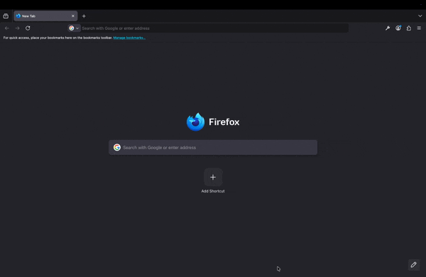

# Carbon Visualiser for Firefox

[](https://github.com/Audio431/carbon-visualiser-xpi/blob/main/LICENSE) [](https://github.com/Audio431/carbon-visualiser-xpi/actions/workflows/CI.yml)

A Firefox browser extension that tracks real-time CPU utilisation and network activity across browser tabs, then converts those measurements into estimated carbon emissions using regional carbon intensity data.

## Why This Exists

Web browsing consumes energy, but the environmental cost is invisible to users. End-user devices account for roughly 51% of streaming-related emissions (Carbon Trust, 2021), yet no browser-native tool exists to measure this impact in real time.

This extension bridges that gap by accessing system-level metrics through Firefox's privileged WebExtension APIs, something standard extensions cannot do. It captures per-process CPU time via `ChromeUtils.requestProcInfo()` and per-request network transfer sizes via the Performance API, then applies empirical conversion factors and live carbon intensity data to estimate CO₂ emissions.

## What It Does

- Tracks CPU time per browser tab using Firefox's internal process monitoring
- Captures network transfer sizes and timing for every request (no DevTools required)
- Converts measurements to energy consumption using the Boavizta API
- Applies real-time carbon intensity data from the UK Carbon Intensity API
- Displays per-session carbon breakdown (device vs. network) in a sidebar panel
- Runs entirely client-side with no external server dependency

## Demo



## Architecture

All data collection and processing runs within the extension:

```text
Content Script (PerformanceObserver)
    ↓ network timing + transfer sizes
Background Script (Aggregation Service)
    ← CPU metrics (ChromeUtils.requestProcInfo)
    ← Carbon intensity (Carbon Intensity API)
    ← Device power profile (Boavizta API)
    ↓ CO₂ estimates
Sidebar UI (React)
```

The extension makes no requests to any server controlled by the developer. The only external calls are to public carbon/energy APIs (Boavizta, UK Carbon Intensity).

### Privileged API Usage

The extension uses `experiment_apis` for read-only access to browser internals:

| API | Purpose | Access Pattern |
|-----|---------|---------------|
| `ChromeUtils.requestProcInfo()` | Per-process CPU time and memory | Read-only |
| `Services.wm.getEnumerator()` | Tab-to-process mapping via outerWindowID | Read-only |

No browser state is modified. No user data leaves the browser.

## Installation

### Requirements

- Firefox Developer Edition or Nightly
- In `about:config`, set:
  - `xpinstall.signatures.required` → `false`
  - `extensions.experiments.enabled` → `true`

### Setup

```bash
git clone https://github.com/Audio431/carbon-visualiser-xpi.git
cd carbon-visualiser-xpi/cost-model-addon
npm install
npm run build
```

Load the extension in Firefox:
1. Open `about:debugging#/runtime/this-firefox`
2. Click "Load Temporary Add-on"
3. Select `cost-model-addon/dist/manifest.json`

### Running Tests

```bash
npm test
```

## Carbon Calculation Methodology

The emission estimates follow the methodology described in the accompanying dissertation (University of Glasgow, 2025).

**CPU emissions** (Equation 5.1):
`E_CPU = T_CPU × P_device × 10⁻³`

Where `T_CPU` is total CPU time in hours and `P_device` is device power consumption in watts, sourced from the Boavizta API.

**Network emissions** (Equation 5.2):
`E_network = T_wait × P_datacenter + D_size × E_transmission`

Where `D_size` is total data transferred and `E_transmission` is 0.065 kWh/GB for fixed-line broadband (Aslan et al., 2018).

**Total CO₂** (Equation 5.3):
`CO₂e = (E_CPU + E_network) × CI_region`

Where `CI_region` is the regional carbon intensity in gCO₂e/kWh.

## Current Scope and Limitations

- CPU power profile is currently configured for Apple M1; configurable device support is planned
- Carbon intensity data uses the UK Carbon Intensity API; global coverage via Electricity Maps is planned
- Network timing for cross-origin resources without `Timing-Allow-Origin` headers will have zeroed timing fields
- Content scripts cannot inject on privileged pages (`about:*`)

## Migration Status

This extension was originally built with a client-server architecture (dissertation version, March 2025). The following changes have been made:

| Component | Before | After |
|-----------|--------|-------|
| Network capture | DevTools `onRequestFinished` (required DevTools open) | `PerformanceObserver` in content script |
| Data aggregation | External Node.js server via WebSocket | Local background script |
| Carbon calculation | Server-side | Client-side |
| External server | Required (Render deployment) | None |
| DevTools dependency | Required | Removed |

Legacy server code remains in `cost-estimation-server/` with a `dontbuild` marker. Removal is pending final validation.

## Roadmap

- [ ] Remove legacy DevTools and WebSocket code
- [ ] Auto-stop tracking on sidebar close
- [ ] Configurable device power profiles (replace hardcoded M1)
- [ ] Global carbon intensity via Electricity Maps API
- [ ] Timer-based tracking UI
- [ ] Per-tab emissions breakdown in real time
- [ ] Privileged signing exploration with Mozilla

## License

[Mozilla Public License 2.0](LICENSE)
